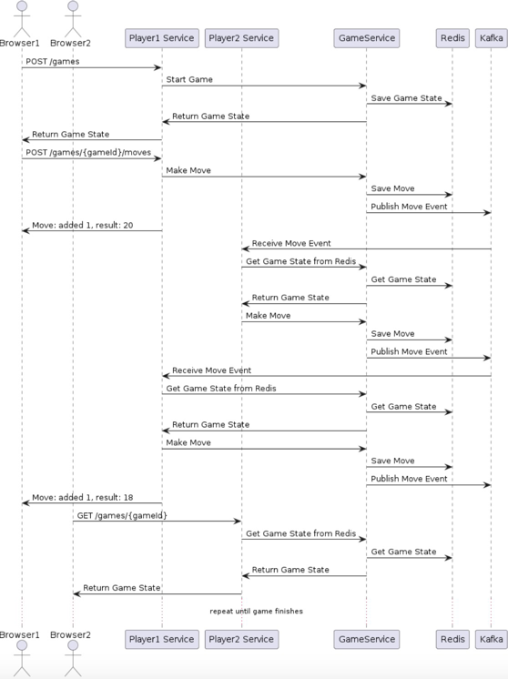
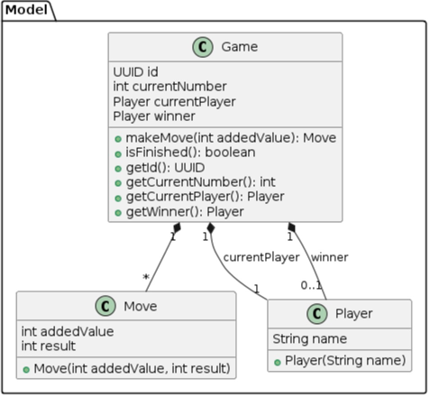

# Games between 2 players

## Design

### System sequences




### Models



### Key point clarity
1. You can use browser(or postman, such kinds of stuff) to call restful API to start game, get game info etc.
2. When game started and first move made, it's ran automatically, can use API GET games/{game-id} to check game info.
3. Using message to notify player move made, it's the communication method between 2 players(2 different instances with same code), will check if message is sent by player himself.
4. If you want to add more players, just add new application-{player name}.yaml, their configurations are separated.
5. There are 2 external&shared components used, redis and kafka, redis is responsible for the storage of game info while kafka is the message queue to help player instances communicate with each other.

## How to use

### Prerequisites
Java 21, maven 3, docker(or podman etc), docker-compose

### Run steps
```shell script
# Run tests
docker-compose up -d
# Run above command first if you want to run integration and e2e tests, if meet issue when creating kafka topic, please use command to create manually

# Test via browser
##1.compile and build project
mvn package -c

##2.Go to pat with "docker_compose.yml", it's to run redis and kafka

##3.Run below command
docker-compose up -d

##4.Go to target folder to use compiled jar

##5.Start 2 instances
java -jar -Dspring.profiles.active=player1 testProject-1.0.jar
java -jar -Dspring.profiles.active=player2 testProject-1.0.jar

##6.Open your browser, 8080 port is for player1 while 8081 port is for player2


```

